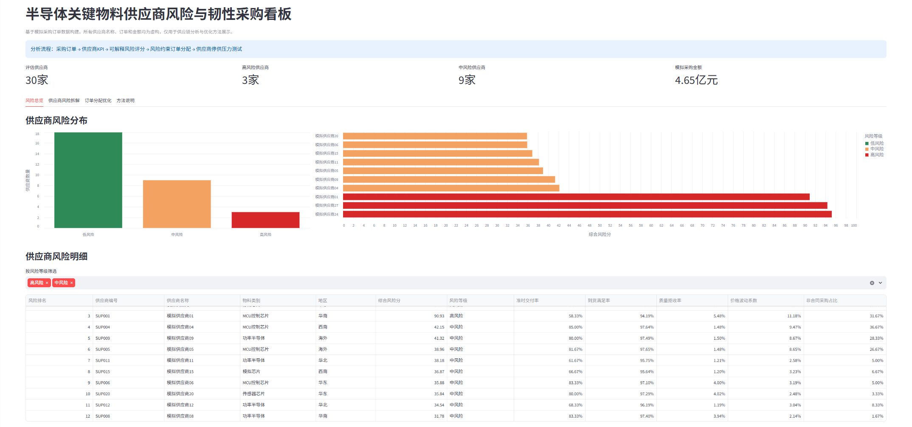
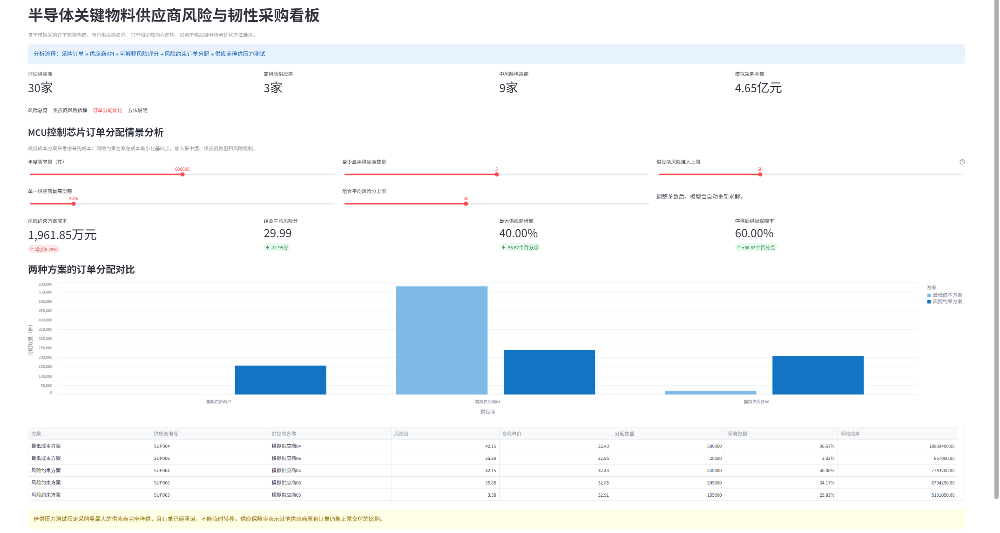
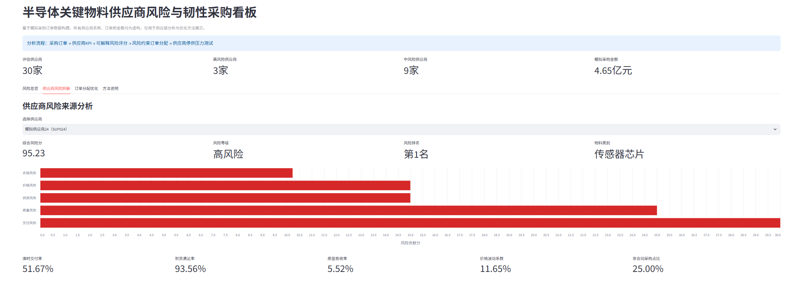

# 半导体关键物料供应商风险评估与韧性订单分配

这是一个面向制造业采购场景的个人项目。项目基于固定随机种子生成的模拟采购订单，完成供应商绩效指标计算、可解释风险评分、风险约束订单分配和停供压力测试，并通过 Streamlit 提供可交互的决策看板。

> 数据声明：所有供应商、订单、价格和采购金额均为模拟数据，不代表任何真实企业或业务结果。


## 项目解决什么问题

采购决策不能只回答“哪家供应商价格最低”，还需要同时考虑交付、质量、供货、价格、合规和供应集中度。本项目围绕一条完整业务链展开：

```text
采购订单 → 供应商KPI → 五维风险评分 → MILP订单分配 → 停供压力测试 → 交互式看板
```

核心问题包括：

- 哪些供应商当前风险较高，风险主要来自哪个维度？
- 如何在产能、MOQ、MPQ和风险限制下分配采购量？
- 降低单一供应商依赖需要增加多少采购成本？
- 最大供应商完全停供后，原订单组合还能保障多少需求？

## 数据规模与核心结果

- 30家模拟供应商，覆盖5类半导体关键物料；
- 1,800笔模拟采购订单，每家供应商60笔；
- 约4.65亿元模拟采购支出；
- 识别3家高风险供应商和9家中风险供应商；
- MCU控制芯片默认情景下，风险约束方案相对最低成本方案：
  - 采购成本增加0.78%；
  - 组合平均风险分由41.94降至29.99；
  - 最大供应商份额由96.67%降至40.00%；
  - 最大供应商停供后的供应保障率由3.33%提高至60.00%。

### 参数敏感性检查

在年度需求60万件、至少启用3家供应商、风险准入上限60分的条件下：

| 情景 | 风险约束方案成本 | 组合平均风险分 | 最大供应商份额 | 停供保障率 |
|---|---:|---:|---:|---:|
| 默认：份额上限40%、平均风险上限30 | 1,961.85万元 | 29.99 | 40% | 60% |
| 放宽份额上限至50% | 1,959.40万元 | 29.99 | 50% | 50% |
| 收紧份额上限至35% | 1,963.26万元 | 28.32 | 35% | 65% |
| 收紧平均风险上限至20 | 1,982.84万元 | 20.00 | 40% | 60% |

结果表明，放宽集中度限制可以小幅降低采购成本，但会降低停供后的供应保障能力；收紧集中度或风险限制能够提高韧性或降低组合风险，但需要付出一定成本。
### 订单分配优化看板



## 方法说明

### 1. 供应商KPI

使用 Pandas 从采购订单中计算：

- 准时交付率与延期率；
- 平均延期天数；
- 到货满足率；
- 质量拒收率；
- 实际采购价格波动系数；
- 非合同采购占比。

### 2. 可解释风险评分

各指标先使用 Min-Max 方法转换为当前供应商群体内的相对风险，再按下列权重加总：

| 风险维度 | 指标 | 权重 |
|---|---|---:|
| 交付风险 | 延期率 | 30% |
| 质量风险 | 质量拒收率 | 25% |
| 供货风险 | 未足量到货率 | 15% |
| 价格风险 | 价格波动系数 | 15% |
| 合规风险 | 非合同采购占比 | 15% |

风险分是当前模拟供应商群体中的相对风险，不代表真实断供概率，也不能直接替代供应商现场审核。
### 单家供应商风险拆解



### 3. 风险约束订单分配

使用 PuLP 构建混合整数线性规划（MILP，Mixed-Integer Linear Programming）模型，并调用 CBC 求解器。模型以采购成本最小为目标，同时满足：

- 总采购量等于年度需求；
- 单家采购量不超过年度产能；
- 启用供应商后必须达到MOQ（Minimum Order Quantity，最小起订量）；
- 采购量必须为MPQ（Minimum Package Quantity，最小包装批量）的整数倍；
- 单一供应商份额不超过设定上限；
- 至少启用指定数量的供应商；
- 超过风险准入上限的供应商不能进入风险约束方案；
- 采购量加权平均风险分不超过设定上限。

### 4. 停供压力测试

压力测试假定当前方案中采购量最大的供应商完全停供，且已承诺订单不能临时转移。停供保障率表示其他供应商原有订单仍可覆盖的需求比例。

这一指标衡量的是既定订单组合的静态抗冲击能力，不等同于考虑应急转单、库存缓冲或替代料后的实际恢复能力。

## 项目结构

```text
.
├── data/
│   ├── suppliers.csv
│   ├── purchase_orders.csv
│   ├── supplier_kpi.csv
│   ├── supplier_risk_score.csv
│   ├── allocation_details.csv
│   └── allocation_summary.csv
├── generate_semiconductor_data.py
├── validate_semiconductor_data.py
├── calculate_supplier_kpi.py
├── calculate_risk_score.py
├── optimize_semiconductor_allocation.py
├── run_pipeline.py
├── risk_dashboard.py
├── requirements.txt
└── LICENSE
```

## 运行方式

建议使用 Python 3.10 或以上版本。

### 1. 安装依赖

```bash
python -m venv .venv
```

Windows PowerShell：

```powershell
.venv\Scripts\Activate.ps1
python -m pip install -r requirements.txt
```

macOS或Linux：

```bash
source .venv/bin/activate
python -m pip install -r requirements.txt
```

### 2. 重新生成全部数据与结果

```bash
python run_pipeline.py
```

该命令会依次执行模拟数据生成、数据质量检查、KPI计算、风险评分和订单分配优化。固定随机种子保证结果可复现。

### 3. 启动交互式看板

```bash
python -m streamlit run risk_dashboard.py
```

浏览器打开终端显示的本地地址后，可以调整年度需求、单家份额上限、供应商数量、组合风险上限和风险准入上限，模型会自动重新求解。

## 文件说明

| 文件 | 作用 |
|---|---|
| `generate_semiconductor_data.py` | 生成供应商主数据和1,800笔模拟采购订单 |
| `validate_semiconductor_data.py` | 检查编号、缺失值、日期、数量、MOQ、MPQ等业务规则 |
| `calculate_supplier_kpi.py` | 从订单明细计算供应商绩效指标 |
| `calculate_risk_score.py` | 计算五维风险贡献、综合风险分和风险等级 |
| `optimize_semiconductor_allocation.py` | 求解最低成本方案和风险约束方案并执行停供测试 |
| `run_pipeline.py` | 按正确顺序运行完整数据与模型流程 |
| `risk_dashboard.py` | 展示风险分布、风险拆解和订单分配情景分析 |

## 项目边界

- 所有业务数据均为模拟数据，结果用于方法展示，不能直接用于真实采购决策；
- 风险评分权重为业务假设，真实应用中应结合专家判断、历史损失和企业风险偏好校准；
- Min-Max评分依赖当前供应商群体，新增或删除供应商可能改变相对风险分；
- 优化模型是单物料、单周期、确定性模型，尚未纳入库存、交期不确定性、替代料和多供应商同时中断；
- 压力测试不考虑停供后的应急转单，因此反映的是订单承诺后的静态供应保障率。

## 开源项目说明

本项目由 [supplier-resilience-demo](https://github.com/nabindev3/supplier-resilience-demo) 改造而来。原项目围绕供应商选择、需求预测、DEA效率评价、订单分配和Nash议价展开；本版本聚焦制造业半导体采购场景，新增并重构了模拟订单数据、供应商KPI、可解释风险评分、风险约束MILP、停供压力测试和Streamlit交互看板。

原项目采用MIT许可证。`LICENSE`中保留原作者版权声明；使用和再发布本项目时应继续保留该许可证及版权信息。

